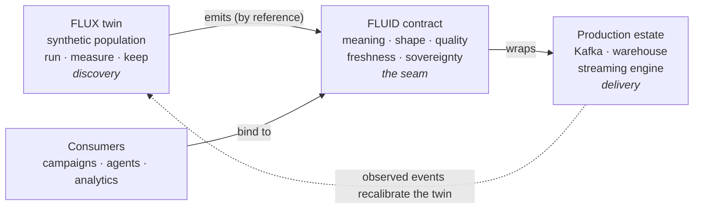

# Two Specs, One Substrate

FLUX and [FLUID](https://open-data-protocol.github.io/fluid/) are separate
standards with separate schemas, designed to interlock at exactly one seam.

**FLUID is the contract for delivery.** A FLUID document declares a data
product's promise — schema, quality, freshness, access policy, sovereignty —
once, in the open, wrapped around the tools a company already runs. Consumers
bind to the contract, never to the plumbing.

**FLUX is the language for discovery.** A FLUX universe is a governed digital
twin: a synthetic population, its behaviours, and the campaigns and
experiments that play out inside it — declared as documents, materialised
deterministically, measured honestly.

## Why they belong together

A company that adopts only FLUID can serve contracts but must still *guess*
which contracts matter. A company that adopts only FLUX can experiment richly
but has no governed path from a proven rule to production. The value is in the
seam:

<MermaidLazy>

</MermaidLazy>

The contract is authored *inside* the twin, proven against synthetic data, and
then — unchanged — wrapped around the production estate. Consumers depend only
on the contract, so the estate can modernise underneath them. Observed
production events flow back (the `Playback` kind) so the twin's evidence stays
faithful to reality.

## The de-riskings this buys

1. **Evidence before capital** — experiments are cheap and declarative, so the
   organisation learns which data products move outcomes *before* funding
   their extraction from the core.
2. **Build only the signals that matter** — a run reveals which signals
   changed the measured outcome; the estate is modernised along the grain of
   value.
3. **Reuse the estate; re-platform never** — winners ship as contracts wrapped
   around tools the company already runs.
4. **Governance as a precondition** — consent reach, sovereignty and agent
   policy are checked offline, before ship, not discovered at launch review.
5. **Determinism as institutional trust** — a board can be shown not a slide
   but a rerunnable artefact.

Continue: [The Six Families](/flux/concepts/families) ·
[The FLUID Seam](/flux/concepts/seam) ·
[Deterministic & Governed](/flux/concepts/determinism-governance)
