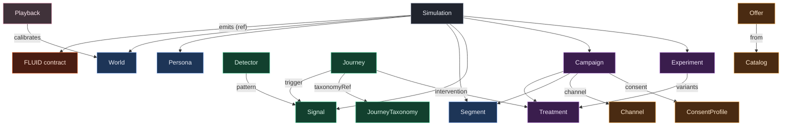

# The Six Families

A FLUX universe is assembled from **nineteen document kinds**, clustered into
six families by responsibility. This factoring is what turns an open-ended
"build me a simulation" problem into a bounded, composable vocabulary.

| Family | Kinds | Question it answers |
|---|---|---|
| **Population** | World, Persona, Segment | *Who* is in the universe |
| **Commerce** | Catalog, Offer, Channel, ConsentProfile | *What* can be sold and *how* it can be reached |
| **Behaviour** | Journey, JourneyTaxonomy, Signal, Detector | *What happens* and *what to watch for* |
| **Activation** | Campaign, Treatment, Experiment | *What we do* about it |
| **Calibration** | Playback | *How the twin stays honest* |
| **Composition** | Simulation, Module, Blueprint, VerticalPack | *How it assembles* and *travels* |

The kinds are not a flat list; they form a **metamodel** in which each kind
references others through named, validated links. `Simulation` is the
composition root: it names a `World`, the `Personas`, `Signals`, `Campaigns`
and `Experiments` that run, and the `Modules` that provide capability — and it
*emits* a FLUID contract at the seam. Every arrow is a reference the
[offline validator](/flux/schema/anatomy#the-offline-validator) resolves, so a
well-formed universe has no dangling links.

<MermaidLazy>



</MermaidLazy>

## One envelope, nineteen shapes

Every kind shares the same envelope — aligned field-for-field with FLUID's:

```yaml
fluxVersion: "0.3.0"     # pinned spec version
kind: Persona            # one of the nineteen
id: pragmatic-family     # unique in the bundle; the target of refs
name: Pragmatic Family
metadata:
  owner:
    team: growth-lab     # accountable owner — required, as in FLUID
spec:                    # kind-specific block, closed and typed
  ...
```

Any kind may additionally declare **`agentPolicy`** and **`skills`** — the
uniform agentic extension point ([details](/flux/concepts/determinism-governance#governed)).

Per-kind field reference: **[The Nineteen Kinds](/flux/schema/kinds)**.
